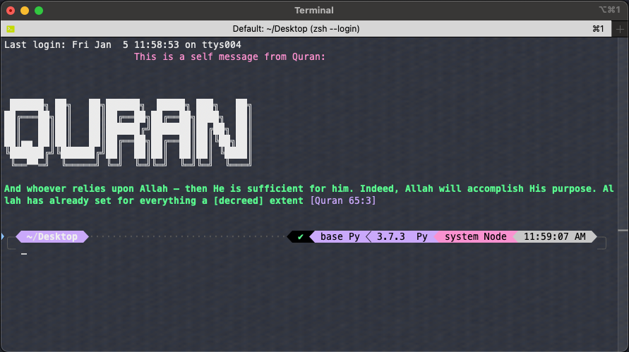
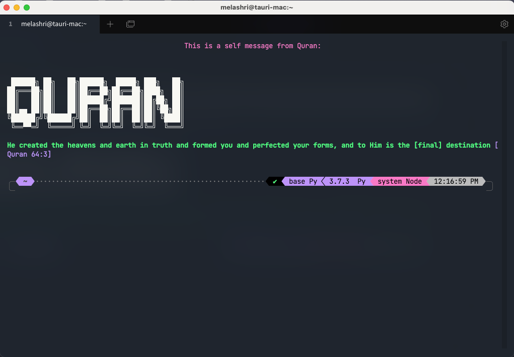

# Terminal Quran

Terminal Quran is a simple Bash script that prints a random verse from the Quran in your terminal. It's a great way to get a dose of spiritual inspiration every time you open your terminal.

## Table of Contents

- [Installation](#installation)
- [Screenshot](#screenshot)
- [Contributing](#contributing)
- [License](#license)

## Installation

To use this script, you need to have Bash installed on your system. Most Linux distributions come with Bash pre-installed. If you're using Windows, you can run Bash scripts using WSL (Windows Subsystem for Linux) or Git Bash. It can work with ZSH (the default on MacOS)

i.e if you want to install it in `$HOME` you need to go to this directory 

``` bash
cd $HOME
```

To install the script, download it directly to your home directory using the following command:

```bash
curl -o ~/terminal_quran.sh https://raw.githubusercontent.com/MohamedElashri/terminal_quran/main/terminal_quran.sh
```

Then, make the script executable:

```
chmod +x ~/terminal_quran.sh
```

To ensure the script can be run from any directory, add its location to your PATH in your shell configuration file. If you're using Bash, add it to your .bashrc file: 

``` bash
echo '$HOME/terminal_quran.sh"' >> ~/.bashrc
```

If you're using Zsh, add it to your .zshrc file: 

```bash
echo '$HOME/terminal_quran.sh"' >> ~/.zshrc
```

Then, source your shell configuration file to apply the changes. For Bash: 

```bash 
source ~/.bashrc
```

For Zsh: 

```bash
source ~/.zshrc
```

## Screenshot

This is an example of how it looks like on ITerm2 on MacOS: 



And this is how it looks on Tabby on MacOS: 



## Contributing

Contributions are welcome! If you have a verse you'd like to add, feel free to open a pull request. Please ensure that any verses you add are accurate and include the surah and verse numbers. 

## License
This project is licensed under the MIT License. See the LICENSE file for details. 
